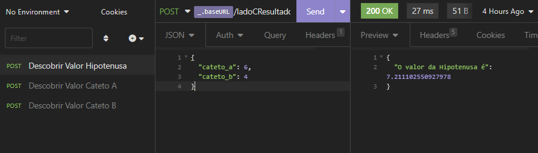
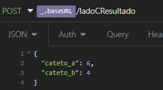
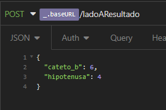
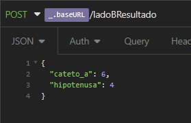
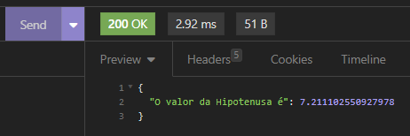

# <h1 style="color:#22a850">Space Cromai</h1>
## Projeto desenvolvido para o processo seletivo do Estágio em Desenvolvimento Backend II da Cromai.

 

## Índice
### Este repositório contém dois projetos: 
 - <a href="#calculadoraWeb">Calculadora de Teorema de Pitágoras</a>
  - <a href="#APITeorema">API de Teorema de Pitágoras</a>

 

<h1 id="calculadoraWeb">Calculadora de Teorema de Pitágoras</h1> 

<h2><a target="_blank" href="https://astiegler.github.io/Space-Cromai/">Acessar no GitHub Pages</a></h2>

## Índice
- <a href="#sobre1">Sobre</a>
- <a href="#tecnologias1">Tecnologias Usadas</a>
- <a href="#comoUsar1">Como Usar</a>

 

## <h2 id="sobre1">Sobre</h2>
Este projeto é uma calculadora simples, com interface responsiva, que permite calcular o valor da hipotenusa e dos catetos de um triângulo retângulo usando o Teorema de Pitágoras. 
<h2><a target="_blank" href="https://astiegler.github.io/Space-Cromai/">Acessar no GitHub Pages</a></h2>

 

## <h2 id="tecnologias1">Tecnologias Usadas</h2>

### Para a Estilização:
- HTML e CSS

### Para a Funcionalidade:
- JavaScript 

 

## <h2 id="comoUsar1">Como Usar</h2>
    Abra o arquivo "index.html" em um navegador ou entre diretamente pelo GitHub Pages pelo link abaixo
<a target="_blank" href="https://astiegler.github.io/Space-Cromai/">https://astiegler.github.io/Space-Cromai/</a>
    
     Preencha dois campos(lados) com números para descobrir o valor do terceiro campo

     Ex: LadoA = 4 e LadoB = 3. 
     Utilizando a fórmula do teorema de Pitágoras, você vai receber o resultado do  LadoC(Hipotenusa), que neste caso é igual a 5.

     Se você deseja saber o valor de um dos Catetos(Lado A ou Lado B), é só preencher o valor da Hipotenusa(Lado C) e o valor de algum dos Catetos.

 
 

# <h1 id="APITeorema">API de Teorema de Pitágoras</h1>

## Índice
- <a href="#sobre2">Sobre</a>
- <a href="#tecnologias2">Tecnologias Usadas</a>
- <a href="#comoUsar2">Como Usar</a>

## <h2 id="sobre2">Sobre</h2>
Este projeto é uma API REST simples, com um endpoint para ser consumido, que permite calcular o valor da hipotenusa e dos catetos de um triângulo retângulo usando o Teorema de Pitágoras. 

Para criar as rotas HTTP e poder testar a API eu utilizei o Insomnia

 

## <h2 id="tecnologias2">Tecnologias Usadas</h2>
 - Python
 - Flask
 - Insomnia

  

 ## <h2 id="comoUsar2">Como Usar</h2>

- Com os arquivos já no seu computador, abra o terminal e acesse a pasta ''Pitágoras'''
-  Instale as depêndencias necessárias usando os comandos: 
` py -3 -m env env`   `venv\Scripts\activate`   `pip install Flask`
- Inicie o servidor usando o comando `python main.py`
- Abra o aplicativo Insomnia ou Postman
- Crie as requisições HTTP com método 'POST' com a url "http://localhost:5000"
- Ao final da URL coloque "/" e o lado do triângulo que deseja saber o resultado 
`/ladoCResultado` Para saber o valor da Hipotenusa 
`/ladoAresultado` Para saber o valor do Cateto A 
`/ladoBResultado` Para saber o valor do Cateto B 
- No Body das requisições selecione JSON e escreva os lados de acordo com a requisição que criou 
- Para saber o resultado da Hipotenusa (Lado C): 

- Para saber o resultado do Lado A: 

- Para saber o resultado do Lado B: 

 
- Altere o número roxo das imagens pelo número que desejar para fazer o cálculo

- Observação:  ` O valor da hipotenusa não pode ser menor do que o valor de qualquer um dos catetos no triângulo retângulo ` 
`O valor da hipotenusa não pode ser maior do que a soma dos valores dos catetos no triângulo retângulo`

- Clique em 'SEND' para enviar os valores e receber o resultado

 
 
 

# Feito por Alan Stiegler
<h2><a target="_blank" href="https://www.linkedin.com/in/alan-stiegler/">Linkedin</a></h2>
     

